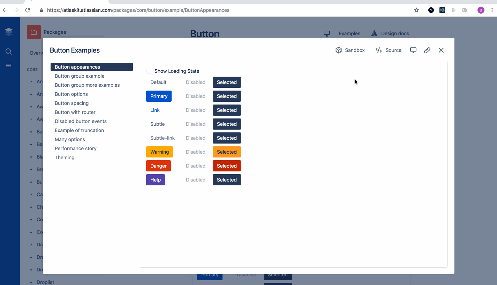
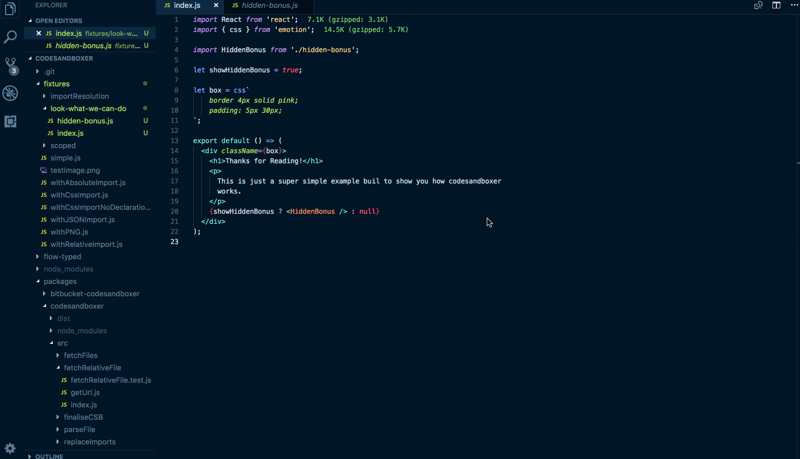

# Codesandboxer

Export a component to codesandboxer:

Codesandboxer is a tool to allow you to deploy to go from an 'entry' file, and deploy that file and all related files to codesandbox. Its goal is to allow you to do this from any component written anywhere, from code you are viewing on github through to code running locally on your machine, as well as build making this easy into your own websites.

To allow its use in multiple contexts, it has been split into a monorepo.

The major use-case for codesandboxer is to allow you to easily share examples with others, or to link to editable versions of examples from a documentation website.

## Cool Stuff

With an entry file, we work to only upload the files you need, and the dependencies you use from your project, making lighter sandbox uploads.

Since we wrap the file we are given, codesandboxer can allow you to quickly open any react component in codesandbox, even if you are not set up to start editing it immediately.

## Core Bits

The core packages, [codesandboxer](/packages/codesandboxer) allows you to fetch files from github or bitbucket, given a git entry file.

[codesandboxer-fs](/packages/codesandboxer-fs) allows you to do the same kinds of actions from your terminal, and can be installed as a CLI. See its documentation for how to use it.

## Other packages

- [react-codesandboxer](/packages/react-codesandboxer) is a react wrapper around `codesandboxer` allowing you to easily render a button to open an example in codesandbox.
- [vs-codesandboxer](/packages/vs-codesandboxer) is a visual studio code extension to allow you to take an open file in vs-code and deploy it to codesandboxer.
- [atom-codesandboxer](https://github.com/noviny/atom-codesandboxer) is an atom extension to allow you to take an open file in atom and deploy it to codesandboxer (IN DEVELOPMENT).
- [bitbucket-codesandboxer](/packages/bitbucket-codesandboxer)

## Desired future packages

Extend codesandboxer to support non-react sandboxes.

## Contributors ✨

Thanks goes to these people ([emoji key][emojis]):

<!-- ALL-CONTRIBUTORS-LIST:START - Do not remove or modify this section -->
<!-- prettier-ignore-start -->
<!-- markdownlint-disable -->
<table>
  <tr>
    <td align="center"><a href="https://github.com/Noviny"> <b>Ben Conolly</b></a> <a href="https://github.com/codesandbox/codesandboxer/issues?q=author%3ANoviny" title="Bug reports">🐛</a> <a href="https://github.com/codesandbox/codesandboxer/commits?author=Noviny" title="Code">💻</a> <a href="https://github.com/codesandbox/codesandboxer/commits?author=Noviny" title="Documentation">📖</a> <a href="#ideas-Noviny" title="Ideas, Planning, & Feedback">🤔</a> <a href="#infra-Noviny" title="Infrastructure (Hosting, Build-Tools, etc)">🚇</a> <a href="#maintenance-Noviny" title="Maintenance">🚧</a> <a href="https://github.com/codesandbox/codesandboxer/commits?author=Noviny" title="Tests">⚠️</a> <a href="#tool-Noviny" title="Tools">🔧</a></td>
    <td align="center"><a href="https://twitter.com/JossMackison"> <b>Joss Mackison</b></a> <a href="https://github.com/codesandbox/codesandboxer/commits?author=jossmac" title="Code">💻</a></td>
    <td align="center"><a href="https://dominik-wilkowski.com"> <b>Dominik Wilkowski</b></a> <a href="#content-dominikwilkowski" title="Content">🖋</a></td>
    <td align="center"><a href="https://github.com/lukebatchelor"> <b>lukebatchelor</b></a> <a href="https://github.com/codesandbox/codesandboxer/commits?author=lukebatchelor" title="Code">💻</a></td>
    <td align="center"><a href="https://twitter.com/CompuIves"> <b>Ives van Hoorne</b></a> <a href="https://github.com/codesandbox/codesandboxer/commits?author=CompuIves" title="Code">💻</a> <a href="https://github.com/codesandbox/codesandboxer/commits?author=CompuIves" title="Tests">⚠️</a> <a href="https://github.com/codesandbox/codesandboxer/commits?author=CompuIves" title="Documentation">📖</a></td>
    <td align="center"><a href="https://gilles.demey.io"> <b>Gilles De Mey</b></a> <a href="https://github.com/codesandbox/codesandboxer/commits?author=gillesdemey" title="Code">💻</a></td>
    <td align="center"><a href="https://github.com/kangweichan"> <b>kangweichan</b></a> <a href="https://github.com/codesandbox/codesandboxer/commits?author=kangweichan" title="Code">💻</a></td>
  </tr>
  <tr>
    <td align="center"><a href="https://michaeldeboey.be"> <b>Michaël De Boey</b></a> <a href="#maintenance-MichaelDeBoey" title="Maintenance">🚧</a></td>
  </tr>
</table>

<!-- markdownlint-enable -->
<!-- prettier-ignore-end -->

<!-- ALL-CONTRIBUTORS-LIST:END -->

This project follows the [all-contributors][all-contributors] specification. Contributions of any kind welcome!

## LICENSE

MIT

<!-- prettier-ignore-start -->
[emojis]: https://allcontributors.org/docs/en/emoji-key
[all-contributors]: https://github.com/all-contributors/all-contributors
<!-- prettier-ignore-end -->
